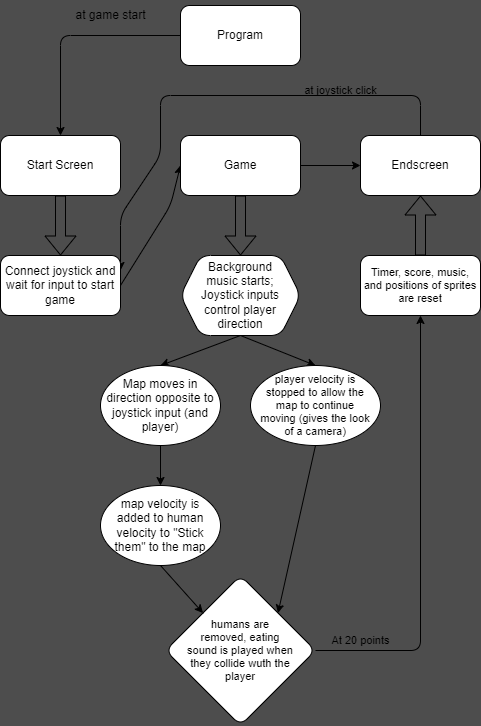

# **ZombieGame**
## ***Cleveland Martin IV***
## *Description*
You are a zombie, and you must eat! Humans spawn around you on the map and you must eat them! Use a joystick to control your zombie, and eat humans worth up to two points! Get to twenty points to win the game, and to see how quick you were!

[***Gameplay Video Link***](https://youtube.com/shorts/Ud6W7sowZnU?si=Qj-x1-VhpHF-LK7i)

## *Project Outline*
This project uses **p5.js**, and the **p5.play**, **tone.js**, **webserial**, and **planck** javascript libraries. It also uses **arduino** to be controlled by a **joystick**, in addition to having an **RGB LED** flash different colors depending on the human eaten. The graphics (except for the map background) were created within the code using squares and rectangles on p5play **sprite objects**. There are unique **eating sounds**. There is also **background music**!

There are **two** different human classes:

1. **Small Human:** 
   - Normal size
   - **Normal** speed
   - Quick chewing sound
   - **One** point
2. **Large Human:**
   - **Large** size
   - **Faster** speed
   - Longer chewing sound
   - **Two** points
  
You get to decide whether the chase is worth the time added at the end!

## *Images*

*This is an in-game image.*

*RGB LED, 3x 220 ohm resistors, ground wire.*

*RGB wires connected on board with ground wire.*

*Joystick Wires connected on board; entire physical setup.*

## *Diagram*

*Basic diagram for how the game communicates.*

## *Thoughts for Future Development*
This game didn't quite turn out as I planned initially. The game actually started as a zombie shooter. I started building the game and physics completely by myself, but I quickly ran into issues once it game to designing a gun that shoots from different positions and rotations on the screen. Even though I was nearly finished with the game, I had to scrap it and restart using p5play as I couldn't create a zombie shooter without a gun to shoot. 

If I were to add anything to this game in the future, I would test different times to win the game, to introduce a time limit. I would make the player have to score a certain amount of points in a certain amount of time. This would then allow me to make a level system, a star system (so you can get 0 - 3 stars on each level), power-ups, a health system, more human types, aggressive human types, zombie hoardes, and more!